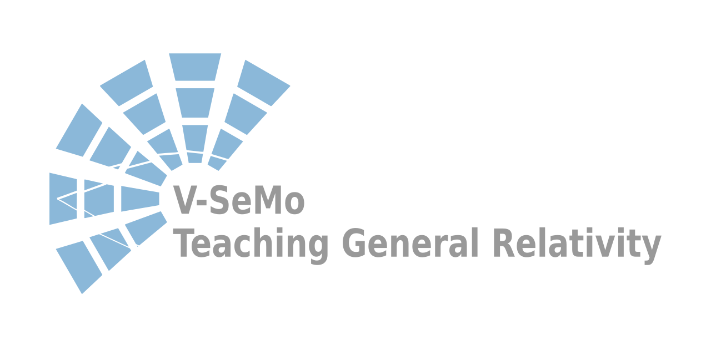
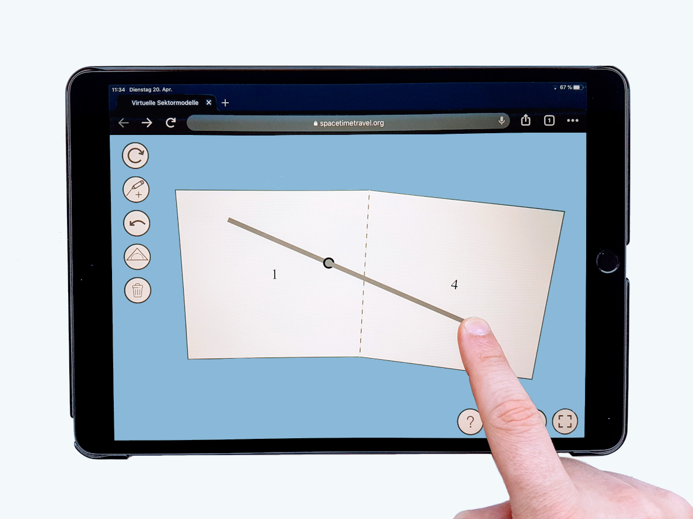

[V-SeMo – Teaching General Reletivity with virtual sector Models](https://v-semo.com/)

[V-SeMo](https://v-semo.com/) is a canvas tool based on fabric.js with the purpose to teach General Relativity with virtual sector models.

## How to get started

Get your local clone of the repository or decompress the downloaded zip/tarball to a local folder
```
git clone https://www.uni-hildesheim.de/gitlab/spacetimetravel/v-semo.git
```

Currently, V-SeMo requires to be delivered by a webserver. A simple way to achieve this for local testing purposes is to launch the simple http server provided by python 3 directly inside the folder containing the just cloned or extracted sources:
```
python3 -m http.server 8080
```

Then, launch your favorite web-browser and direct it to:
```
http://localhost:8080/wormhole_circ_3_8.html?showExerciseBox=1&buildStartMarks=1
```

Note that there are a bunch of other `*.html` files in the folder to try and investigate. They reference other script files, especially the ones in `./parameter_files` and `./exercises`, which define the parameters of the sector model and the text and behaviour of the so-called "excercise box". A more detailed documentation of the various URL parameters is still missing, but you may want to take a look into `./url_variabled.js`

## V-SeMo in Action

